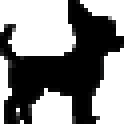

# RunDog365 🐕

**A cute running animal animation on your Windows Taskbar.**

> [! NOTE]
> Special thanks to [@Kyome22](https://github.com/Kyome22) for the original [RunCat365](https://github.com/Kyome22/RunCat365) project. This version adds new animal runners. 

---

## 🆕 New Animal Characters

In addition to the original cute cat, we've added three new animal characters: 

### 🐕 Great Dane

A gentle giant running across your taskbar! 

### 🐶 Chihuahua

A tiny but energetic companion for your desktop!

### 🦎 Frilled Lizard

Watch this unique reptile sprint with its iconic frill!

---

## Demo

 

 

## Installation

- Requirement: Windows 10 version 19041.0 or higher
- Language:  English, Japanese

`C#` `Win32` `.NET 9.0` `Visual Studio` `RunCat`

---

## 📌 Original Project

This project is based on the following original repository:

| Item | Link |
|------|------|
| 🔗 Original Repository | [Kyome22/RunCat365](https://github.com/Kyome22/RunCat365) |
| 👤 Original Author | [@Kyome22](https://github.com/Kyome22) |
| 🏪 Microsoft Store | https://apps.microsoft.com/detail/9nw5lpnvwfwj |

## Original Contributors

---

## License

This project is licensed under the [Apache License 2.0](https://github.com/Kyome22/RunCat365/blob/main/LICENSE), same as the original project. 